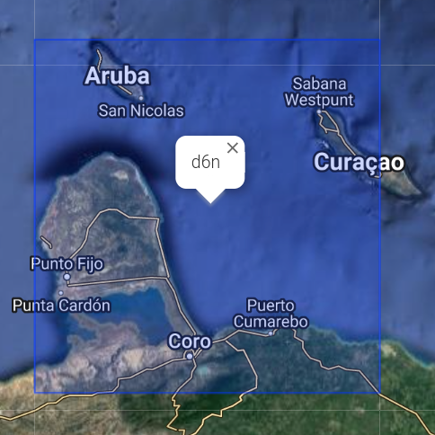
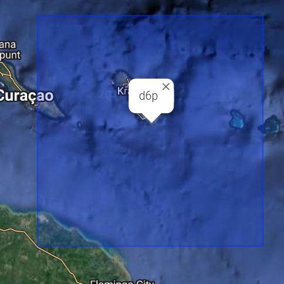

# Hardhat Typescript

See top-level README for commands

## Geohash Registry

The function of the registry is twofold:

* provide a list of "approved" GeoNFTs
* geospatial searching

### Geohash

Our current approach to geospatial searching is to use [Geohash](https://en.wikipedia.org/wiki/Geohash).

An eight character geohash will provide us with ~20m resolution.

Here is the eight character geohash for each point in a rectangle that covers Curacao:

1) NW - `d6nxpk4n` -69.28802490234375, 12.503621207746889
2) NE - `d6pr0hhn` -68.54919433593749, 12.503621207746889
3) SE - `d6p781k5` -68.54919433593749, 11.872726613435072
4) SW - `d6nex365` -69.28802490234375, 11.872726613435072

By distilling down the above hashes, you can see Curacao is covered by two geohashes:

* `d6n` in the west
* `d6p` in the east




Images from <https://www.movable-type.co.uk/scripts/geohash.html>

The geohash length of 3 characters is equal to an area of 156km x 156km.

### Contract storage

The current design is to track the eight character geohash for each GeoNFT. The mapping will look like this:

```solidity
struct Node {
    uint256[] data; // nft ids
}

// geohash as string
mapping(string => Node) private nodes;
```

For example, GeoNFT #1 is at `d6nuzk8c` and GeoNFT #2 is at `d6nuzk8d`. In the current design, there would be two nodes in the mapping:

* `d6nuzk8c` -> [1]
* `d6nuzk8d` -> [2]

```text
,----------.      ,----------.
| d6nuzk8c |      | d6nuzk8d |
`----+-----'      `----+-----'
    [1]               [2]
```

Additional testing is needed to understand if we could improve performance by storing the uint values in parent geohashes. With the example above, we could create a parent node `d6nuzk8` that would represent the parent of the two child nodes:

* `d6nuzk8` -> [1, 2]

```text
         ,---------.
         | d6nuzk8 |
         `----+----'
          / [1,2] \
         /         \
,----------.      ,----------.
| d6nuzk8c |      | d6nuzk8d |
`----+-----'      `----+-----'
    [1]               [2]
```

This seven character geohash `d6nuzk8` covers about 153m x 153m.

We could generate the parent geohash mappings all the way up to the two geohashes that cover all Curacao:
`d6n` in the west and `d6p` in the east.

### Prior work

Foam created the concept of [Crypto Spatial Coordinates (CSC)](https://blog.foam.space/crypto-spatial-coordinates-fe0527816506) which is a combination of a geohash and an Ethereum address

### References
* [Z-order](https://en.wikipedia.org/wiki/Z-order_curve)
* [Hilbert](https://en.wikipedia.org/wiki/Hilbert_curve)
* [S2 Geometry](https://s2geometry.io/devguide/s2cell_hierarchy.html)
* [Geohash library for nodejs](https://github.com/sunng87/node-geohash)